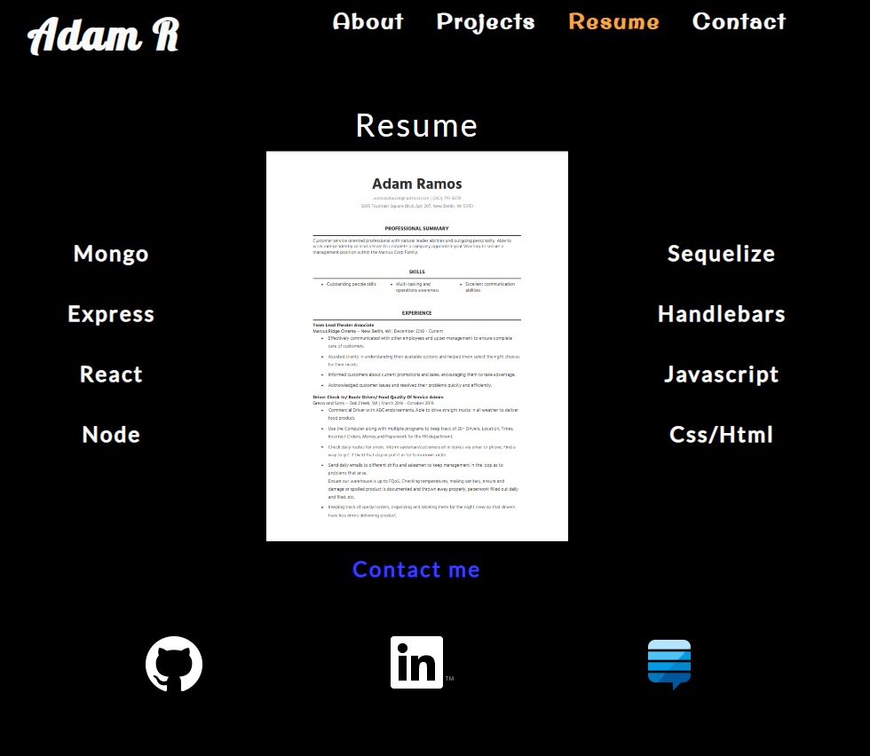

# AdamR-Portfolio

## License

## Table of Contents

 * [Installation](#installation)
 * [Usage](#usage)
 * [Credits](#credits)
 * [License](#license)
 
## Description

Its Adam Ramos' portfolio site made with React

## Usage

To give potential employeers info about Adam and his work.

## Installation

>none

## Languages

JavaScript ,HTML ,CSS ,ES6 ,Node 

## Questions

### AdamR-Work

https://github.com/AdamR-Work/AdamR-Portfolio

## Contributing

## Tests

>no

## Credits

